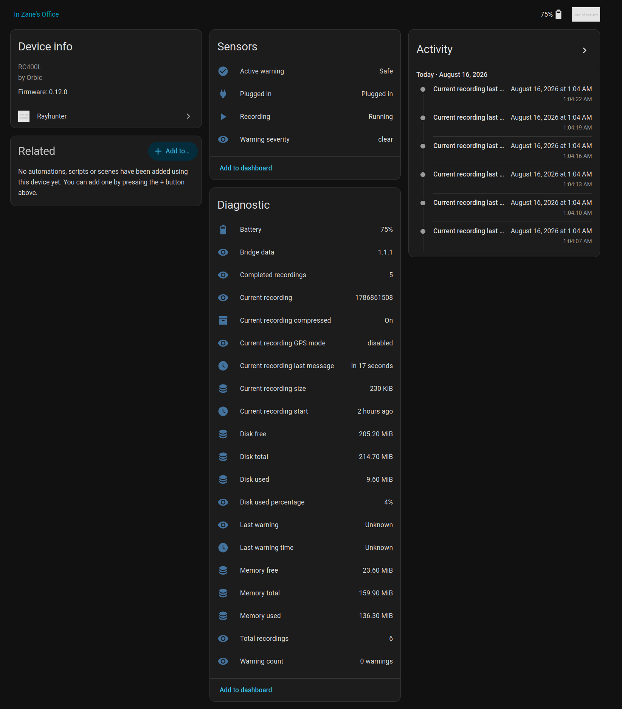
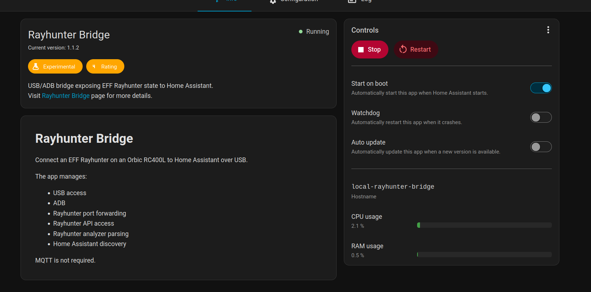

# Rayhunter for Home Assistant

<p align="center">
  Home Assistant integration for the EFF Rayhunter running on an Orbic RC400L.
</p>

<p align="center">
  USB/ADB connection · Native Home Assistant entities · No MQTT required
</p>

---

## Overview

**Rayhunter for Home Assistant** connects an EFF Rayhunter device directly to Home Assistant OS.

The project consists of two pieces:

- **Rayhunter Bridge** — a Home Assistant app that manages USB access, ADB, port forwarding, and communication with Rayhunter.
- **Rayhunter Integration** — a native Home Assistant custom integration that turns Rayhunter state into devices, sensors, and binary sensors.

The bridge communicates directly with Rayhunter's HTTP API. MQTT, Mosquitto, and external message brokers are not required.





### Architecture

```text
┌─────────────────────┐
│    Orbic RC400L     │
│   EFF Rayhunter     │
└──────────┬──────────┘
           │
           │ USB / ADB
           ▼
┌─────────────────────┐
│  Rayhunter Bridge   │
│ Home Assistant App  │
└──────────┬──────────┘
           │
           │ Internal HTTP API
           ▼
┌─────────────────────┐
│     Rayhunter       │
│  HA Integration     │
└──────────┬──────────┘
           │
           ▼
┌─────────────────────┐
│ Home Assistant      │
│ Device & Entities   │
└─────────────────────┘
           │
           ▼
┌─────────────────────┐
│ Your automation     │
│                     │
└─────────────────────┘
```

---


## Features

- Direct USB connection between Home Assistant OS and the Orbic RC400L
- Automatic ADB device detection
- Persistent ADB port forwarding to the Rayhunter API
- Native Home Assistant device and entity model
- Live Rayhunter warning state
- Warning severity tracking
- Recording state and metadata
- Battery and charging status
- Storage statistics
- Memory statistics
- Rayhunter runtime information
- Home Assistant Supervisor discovery
- Automatic unavailable state if communication fails
- No MQTT dependency
- No cloud dependency

---

## Home Assistant Entities

### Primary

| Entity | Description |
|---|---|
| **Active warning** | Indicates whether Rayhunter has detected a Low, Medium, or High severity event |
| **Warning severity** | Highest warning severity observed during the current recording |
| **Recording** | Indicates whether Rayhunter is currently recording |
| **Plugged in** | Orbic external-power state |

### Diagnostics

The integration also exposes:

- Battery level
- Bridge version and bridge data
- Current recording
- Current recording start time
- Current recording size
- Current recording last-message time
- Current recording GPS mode
- Current recording compression state
- Completed recording count
- Total recording count
- Warning count
- Last warning
- Last warning time
- Disk total
- Disk used
- Disk free
- Disk usage percentage
- Memory total
- Memory used
- Memory free

Storage and memory values use Home Assistant-native KiB/MiB units.

---

## Warning Behavior

Rayhunter reports four event severities:

```text
Informational
Low
Medium
High
```

For Home Assistant:

- **Informational** does not activate the warning sensor.
- **Low**, **Medium**, and **High** activate `Active warning`.
- `Warning severity` reflects the highest warning observed during the current recording.
- Starting a new recording resets the current warning state.

If communication with Rayhunter is lost, the integration becomes **Unavailable** instead of incorrectly reporting a safe state.

---

## Requirements

This project is currently designed and tested around:

- Home Assistant OS
- Raspberry Pi 4
- Orbic RC400L
- EFF Rayhunter
- USB connection between the Home Assistant host and Orbic
- ADB enabled on the Orbic

Current tested Rayhunter version:

```text
0.12.0
```

Other Home Assistant OS hardware may work as long as USB passthrough and the required architecture are supported.

The bridge currently supports:

```text
aarch64
amd64
```

---

## Installation

### 1. Add the app repository

In Home Assistant, open:

**Settings → Apps → App Store → Repositories**

Add:

```text
https://github.com/zaneprall/rayhunter_bridge
```

Install **Rayhunter Bridge**.

### 2. Connect the Orbic

Connect the Orbic RC400L directly to the Home Assistant host over USB.

ADB must already be enabled and authorized on the device.

### 3. Install the custom integration

The Home Assistant integration is included in this repository:

```text
custom_components/rayhunter
```

For now, copy that directory into:

```text
/config/custom_components/rayhunter
```

```text
cp -a custom_components/rayhunter /config/custom_components/
```

Then restart Home Assistant Core.

A packaged integration installation method may be added later.

### 4. Start Rayhunter Bridge

Start the Rayhunter Bridge app.

The app publishes Supervisor discovery information, allowing Home Assistant to discover the internal bridge address automatically.

Manual integration configuration remains available as a fallback.

---

## Bridge API

Rayhunter Bridge exposes a small read-only HTTP API internally to Home Assistant.

### `GET /api/status`

Returns the bounded state used by the Home Assistant integration.

Includes:

- Rayhunter availability
- recording state
- warning state
- battery state
- system statistics
- current recording metadata
- Rayhunter runtime metadata

### `GET /api/raw`

Returns the upstream Rayhunter system-statistics and QMDL-manifest responses for diagnostics.

Home Assistant does not continuously poll this endpoint because the historical manifest can grow over time.

### `GET /healthz`

Simple bridge health endpoint.

Example:

```json
{
  "ok": true,
  "api_version": 1,
  "bridge_version": "1.1.1"
}
```

---

## Failure Handling

The bridge intentionally fails closed from Home Assistant's perspective.

If any of the following become unavailable:

- USB device
- ADB
- ADB forwarding
- Rayhunter HTTP API
- Rayhunter Bridge API

the Home Assistant coordinator marks Rayhunter entities as **Unavailable**. Check the logs first. 

A broken connection therefore cannot silently appear as a safe cellular environment.

---

## Repository Layout

```text
rayhunter_bridge/
├── repository.yaml
├── README.md
├── LICENSE
│
├── custom_components/
│   └── rayhunter/
│       ├── __init__.py
│       ├── api.py
│       ├── binary_sensor.py
│       ├── config_flow.py
│       ├── const.py
│       ├── coordinator.py
│       ├── entity.py
│       ├── manifest.json
│       ├── sensor.py
│       └── translations/
│           └── en.json
│
├── docs/
│   └── images/
│
└── rayhunter_bridge/
    ├── config.yaml
    ├── Dockerfile
    ├── README.md
    ├── rayhunter_bridge.py
    └── run.sh
```

---

## Versions

| Component | Version |
|---|---:|
| Rayhunter Bridge app | `1.1.2` |
| Bridge API implementation | `1.1.1` |
| Home Assistant integration | `0.3.2` |
| Tested EFF Rayhunter | `0.12.0` |

---

## Development Progress

The core integration is functional and has been tested end-to-end with a physical Orbic RC400L running Rayhunter.

current functionality includes:

- USB detection
- ADB connection
- automatic ADB forwarding
- Rayhunter API access
- Home Assistant polling
- recording state
- device diagnostics
- live warning detection
- severity reporting
- recovery to a safe state after starting a new recording

Further cleanup and packaging improvements are ongoing.

---

## Rayhunter

[Rayhunter](https://github.com/EFForg/rayhunter) is an open-source project from the Electronic Frontier Foundation for detecting potentially suspicious cellular-network behavior.

This Home Assistant project is independent and is **not maintained or endorsed by the Electronic Frontier Foundation**.

---

## License

See [LICENSE](LICENSE).
